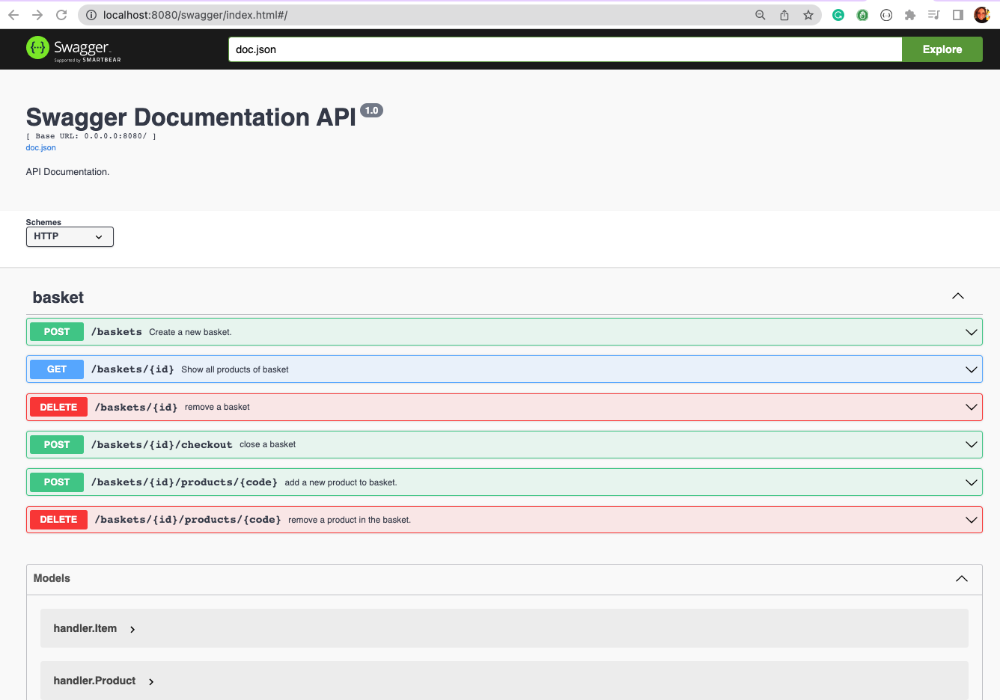

PepitoStore is thinking about expanding its business and not only forecast sales in the stores but
also manage the cash register. The first store where we will introduce our software will sell the
following 3 products.
```
Code         | Name              |  Price
-----------------------------------------------

[](https://app.codacy.com/gh/patriciabonaldy/cash_register?utm_source=github.com&utm_medium=referral&utm_content=patriciabonaldy/cash_register&utm_campaign=Badge_Grade_Settings)

VOUCHER      | Gift Card         |   5.00€
TSHIRT       | Summer T-Shirt    |  20.00€
PANTS        | Summer Pants      |   7.50€
```

The different departments have agreed the following discounts:

* A 2-for-1 special on VOUCHER items. 
* If you buy 3 or more TSHIRT items, the price per unit should be 19.00€. 
* Items can be scanned in any order, and the cashier should return the total amount to be
paid.

The interface for the checkout process has the following specifications:

* The Checkout constructor receives a pricing_rules object 
* The Checkout object has a scan method that receives one item at a time


Examples:

* Items: VOUCHER, TSHIRT, PANTS - Total: 32.50€ 
* Items: VOUCHER, TSHIRT, VOUCHER - Total: 25.00€ 
* Items: TSHIRT, TSHIRT, TSHIRT, VOUCHER, TSHIRT - Total: 81.00€ 
* Items: VOUCHER, TSHIRT, VOUCHER, VOUCHER, PANTS, TSHIRT, TSHIRT - Total:
74.50€

## Endpoints

name                                   method          description
- /health                              GET             Check status of app is (live/died)

- /baskets                             POST            Create a new basket
- /baskets/:id                         GET             Get a basket
- /baskets/:id                         DELETE          delete a basket

- /baskets/:id/products/:code          POST            return basket with a new product

- /baskets/:id/products/:code          DELETE          Return basket without this product

- /baskets/:id/checkout   

To watch, please click in the next link:

http://localhost:8080/swagger/index.html#/

These are detail endpoints




## Client

Also, you can run a local client instead of swagger


To run client
~~~bash
go run client/cli.go

Usage:
  app [command]

Examples:
you can us the follow commands: create/add/remove/checkout

Available Commands:
  basket      call different operations
Flags:
  -h, --help   help for app


~~~
EXAMPLES:

* create a new basket
~~~bash
go run client/cli.go basket create

output:

Basket created
{"Code":"f855f846-5057-11ec-b55b-1e003b1e5256","Items":{},"Total":0,"Close":false}
~~~

* remove basket
~~~bash
go run client/cli.go basket remove fa4ae6e8-5057-11ec-b55b-1e003b1e5256

output:

basket ID deleted
~~~

* add a new product to a basket
~~~bash
go run client/cli.go basket add f855f846-5057-11ec-b55b-1e003b1e5256 TSHIRT

output:

product added
~~~

* close basket and get total amount
~~~bash
go run client/cli.go basket checkout f855f846-5057-11ec-b55b-1e003b1e5256

output:

Basket ID: f855f846-5057-11ec-b55b-1e003b1e5256
Items:
      Item: VOUCHER
      Quantity: 1      Unit price: 7.5
      Total With Discount:         7.5
      Item: PENTS
      Quantity: 4      Unit price: 5
      Total With Discount:         15
      Item: TSHIRT
      Quantity: 4      Unit price: 20
      Total With Discount:         60
----------------------------------------
Amount Total: 82.5

~~~
